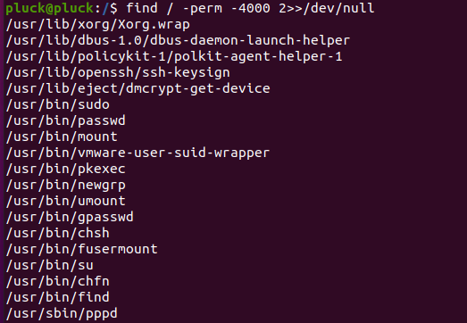
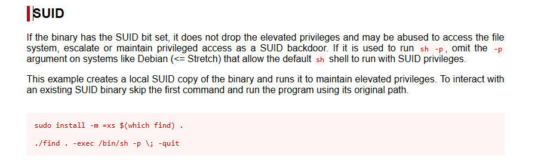

# Privilege Escalation – Pluck CMS 4.7.16 Lab

## Objective
Demonstrate privilege escalation from a low-privileged user to root in a controlled
Linux lab environment using real-world techniques.

This privilege escalation exercise was performed against a vulnerable lab
environment based on **Pluck CMS 4.7.16**.

---

## Initial Access Context
A low-privileged shell was  obtained on the target system as user:
```
pluck@pluck:/$ whoami
pluck
```
The goal was to escalate privileges to the root user.

---

## Enumeration – SUID Binary Discovery

To identify potential privilege escalation vectors, files with the SUID bit set
were enumerated using the following command:

```
find / -perm -4000 2>/dev/null
```


- `-perm -4000` filters for files with the SUID permission enabled  
- `2>/dev/null` suppresses permission denied errors  

The output revealed multiple binaries with SUID permissions, including:
```
/usr/bin/find
```
This binary was identified as a strong candidate for exploitation.

---

## Privilege Escalation via SUID `find` Binary

After identifying the SUID-enabled `find` binary, the GTFOBins resource was
consulted to confirm whether this binary could be abused for privilege escalation.



GTFOBins confirms that `find` with SUID permissions can be abused to spawn a
privileged shell.

### Exploitation Commands Used

```
sudo install -m =xs $(which find) .
./find . -exec /bin/sh -p ; -quit
```

## Proof of Privilege Escalation

After execution, the shell prompt changed to root (#), confirming successful
privilege escalation.

Verification:


With root privileges, access to the `/root` directory was confirmed.

---

## Result
This demonstrates a successful privilege escalation due to:
- Misconfigured SUID binary permissions
- Ability to execute system binaries with elevated privileges
- Lack of proper privilege separation

This exercise validates the importance of proper file permission management and
system hardening.

